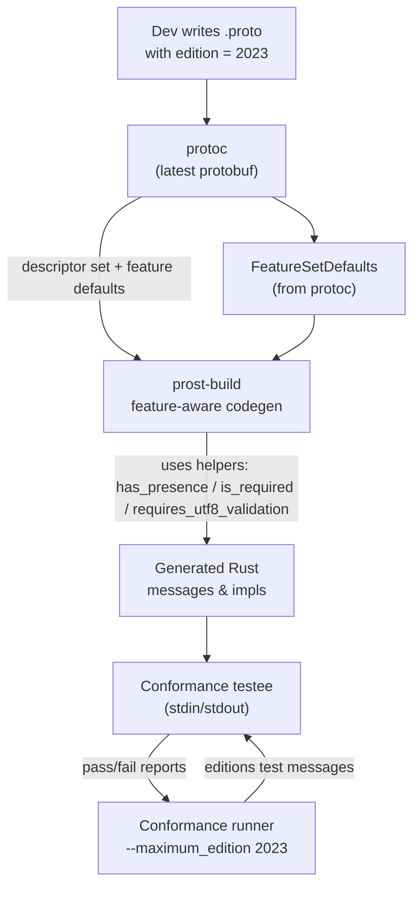

# Protobuf Editions 2023 Requirements

## Task list — “Prost: Edition 2023, for real”

### (A) Product & scope (what “done” means)

1. **Edition 2023 codegen parity** prost-build can ingest `.proto` files with `edition = "2023"` and generate correct
   Rust types/impls with the right presence, required-ness, packing, limits, and comments. No regressions for proto2/3.
   ([GitHub][1])

2. **Feature-based behavior, not syntax checks** Stop branching on `syntax` and use **resolved features** (e.g.,
   presence, required, UTF-8 rules). Editions cascade features lexically; codegen must consume the resolved feature set
   instead of `syntax == X` checks. ([protobuf.dev][2])

3. **Conformance: editions on** Conformance runner is wired to editions tests (`--maximum_edition 2023`) and passes
   them, including the three editions test messages. ([protobuf.dev][2])

4. **Use latest upstream protobuf** Build/tests use the latest `protocolbuffers/protobuf` (C++ toolchain) that includes
   editions + conformance for editions. ([protobuf.dev][2])

---

### (B) Codegen changes (prost-build)

1. **Accept and propagate editions**

   - Teach `prost-build` to recognize `edition = "2023"` source files (parsing via `protoc` descriptors where
     `FileDescriptorProto.syntax` reports “editions”). Avoid the earlier panic path. ([GitHub][3])
   - Add a new `Edition2023` internal variant only as a transitional shim; feature flags should drive behavior, not the
     variant itself (see below). ([GitHub][1])

2. **Feature resolution plumbing (generator side)**

   - Consume **resolved features** from descriptors; **remove direct syntax checks**. Implement helpers equivalent to
     the docs (e.g., `has_presence`, `is_required`, `requires_utf8_validation`) and drive codegen from them.
     ([protobuf.dev][2])
   - Implement “legacy unification”: when compiling proto2/3, infer edition features so the same helpers work everywhere
     (LEGACY_REQUIRED, PACKED/EXPANDED, group encoding behavior). ([protobuf.dev][2])

3. **Presence & required semantics in Rust**

   - For Edition 2023, apply **explicit presence** to relevant scalar fields → generate `Option<T>` (repeated never has
     presence; message/oneof always have it; scalar presence iff `field_presence != IMPLICIT`). ([protobuf.dev][2])
   - Support **required** (LEGACY_REQUIRED semantics where applicable via features), including validation at parse/build
     time consistent with spec. ([protobuf.dev][2])

4. **Options & limits**

   - Respect edition-controlled options (e.g., `packed`, `deprecated`) and enforce edition limits (e.g., large but
     finite field/enumeration count constraints used in the PR text). ([GitHub][1])
   - Ensure **JSON mapping** and **unknown fields** behavior matches the editions language guide (no codegen surprises).
     ([protobuf.dev][4])

5. **Generator capability signaling**

   - In `CodeGeneratorResponse.supported_features`, set `FEATURE_SUPPORTS_EDITIONS` and advertise
     `minimum_edition`/`maximum_edition` (min = proto2 legacy, max = 2023 for now). `protoc` rejects generators that
     don’t declare this. ([protobuf.dev][2])

6. **Docs & examples**

   - Update README and examples to show `edition = "2023"` usage and `protoc` args needed (no `--experimental_editions`
     on modern protoc). Link to editions docs. ([protobuf.dev][4])

**Acceptance:** Generate Edition 2023 protos with correct `Option<T>`, pass presence/required unit tests, and no
proto2/3 regressions.

---

### (C) Runtime/library considerations (prost)

Most editions logic lives in codegen; prost runtime should **not** re-implement feature resolution. If any reflection
APIs depend on syntax checks, route them through codegen-provided metadata. ([protobuf.dev][2])

**Acceptance:** No runtime `syntax` branches remain; behavior derives from generated types/metadata.

---

### (D) Conformance (with latest `protocolbuffers/protobuf`)

1. **Upgrade toolchain**

   - Use latest upstream `protocolbuffers/protobuf` in CI (protoc + conformance test runner). This version includes
     editions and the editions conformance entries. ([protobuf.dev][2])

2. **Wire up editions tests**

   - Run the conformance runner with `--maximum_edition 2023`.
   - Ensure the prost conformance **testee** recognizes and links the three new messages:

     - `protobuf_test_messages.editions.proto2.TestAllTypesProto2`
     - `protobuf_test_messages.editions.proto3.TestAllTypesProto3`
     - `protobuf_test_messages.editions.TestAllTypesEdition2023` ([protobuf.dev][2])

3. **Plumb I/O exactly like before**

   - Keep the simple stdin/stdout harness; just ensure generated code for the editions protos is used by the testee.
     ([GitHub][5])

4. **CI matrix**

   - Add a CI job to run the editions slice of conformance plus the legacy proto2/3 suite to prevent regressions.

**Acceptance:** Editions conformance slice green; legacy conformance still green. A comment in the PR thread explicitly
called out “not quite enough to pass conformance without feature resolution”—this addresses that. ([GitHub][1])

---

### (E) Back-compat & migration

- **Proto2/3 still first-class:** Keep behavior unchanged for existing users; we only refactor internals to flow through
  features so future editions (2024+) become additive. ([protobuf.dev][2])
- **Field numbering and reserved ranges:** No generator regressions vs. the editions language guide’s limits and
  reserved ranges. ([protobuf.dev][4])

**Acceptance:** Existing prost users see no behavior change when staying on proto2/3.

---

### (F) Risks & mitigations

- **Feature resolution drift**: If we mis-resolve cascading features, conformance breaks. Mitigate by adhering to the
  “helpers” contract and relying on protoc-provided defaults where possible. ([protobuf.dev][2])
- **Spec nuance**: Enum defaults, UTF-8 enforcement, and unknown fields behavior must match the editions guide. Add unit
  tests mirroring the guide’s examples. ([protobuf.dev][4])
- **Tooling skew**: Pin CI to a known-good `protoc` release (the _latest_ when we merge); document the minimum required
  protoc for end users. ([protobuf.dev][2])

---

### (G) Deliverables checklist

- [ ] `prost-build`: feature-driven codegen (helpers wired)
- [ ] `prost`: no `syntax` branches; any reflection paths use generated metadata
- [ ] Conformance harness updated; editions slice enabled; CI job added ([GitHub][5])
- [ ] README + example protos updated to show `edition = "2023"` build incantations ([protobuf.dev][4])
- [ ] Release notes calling out Edition 2023 support & minimum protoc

---

## Architecture sketch (how the bits talk)

---

### Notes from the PR & ecosystem (why these tasks)

- The PR adds an `Edition2023` variant, explicit presence → `Option<T>`, reserved/packed/deprecated handling, and
  validates limits; reviewers flagged that **just swapping syntax checks isn’t enough** — proper **feature cascading**
  is required to pass conformance. ([GitHub][1])
- Official docs spell out **generator responsibilities**, **feature helpers**, **legacy unification**, and **how to
  enable editions conformance** (`--maximum_edition 2023`), plus the exact editions test messages. ([protobuf.dev][2])
- The language guide clarifies presence, required, reserved ranges, and unknown fields semantics under editions.
  ([protobuf.dev][4])

---

### Acceptance criteria (hard pass/fail)

1. `prost-build` can compile at least one reference set of `.proto` files with `edition = "2023"` from the docs/tutorial
   without manual flags; generated Rust uses `Option<T>` correctly per presence rules. ([protobuf.dev][4])
2. Running the conformance suite with editions enabled shows green for: proto2→2023, proto3→2023, and
   `TestAllTypesEdition2023`. ([protobuf.dev][2])
3. All existing proto2/3 conformance remains green.
4. No code paths branch on `syntax`; helpers are the source of truth. ([protobuf.dev][2])

---

[1]:
  https://github.com/tokio-rs/prost/pull/1318
  "Add comprehensive Edition 2023 support to prost-build by techtoine · Pull Request #1318 · tokio-rs/prost · GitHub"
[2]: https://protobuf.dev/editions/implementation/ "Implementing Editions Support | Protocol Buffers Documentation"
[3]: https://github.com/tokio-rs/prost/issues/1031 "Add support for editions · Issue #1031 · tokio-rs/prost · GitHub"
[4]: https://protobuf.dev/programming-guides/editions/ "Language Guide (editions) | Protocol Buffers Documentation"
[5]:
  https://github.com/protocolbuffers/protobuf/blob/main/conformance/README.md?utm_source=chatgpt.com
  "protobuf/conformance/README.md at main · protocolbuffers/protobuf"
